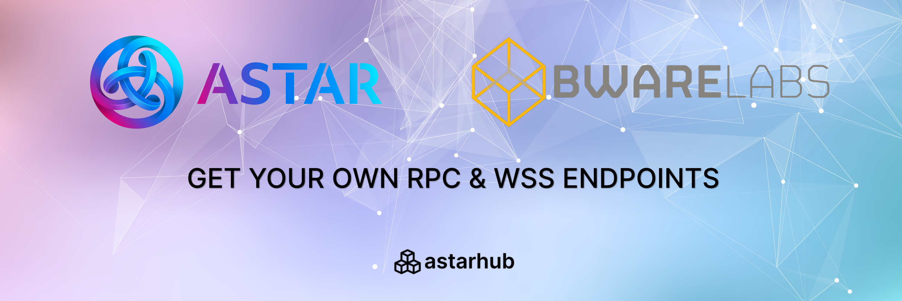
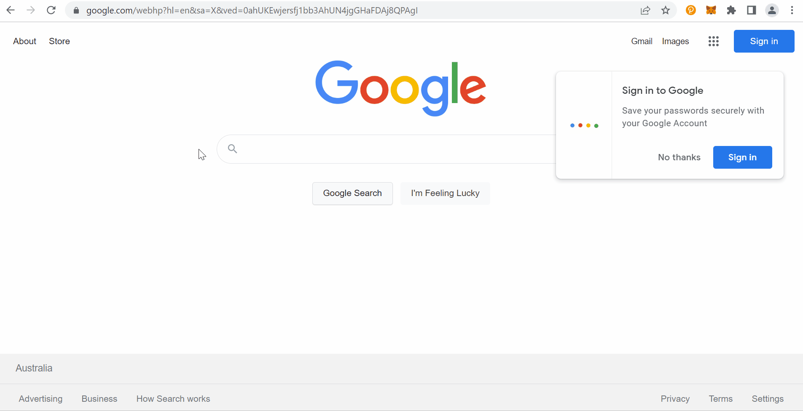
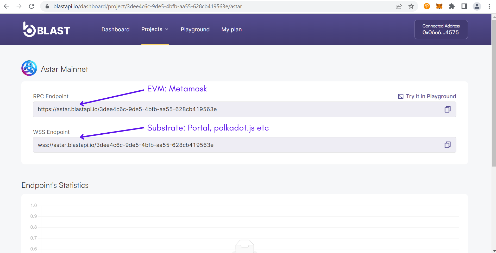
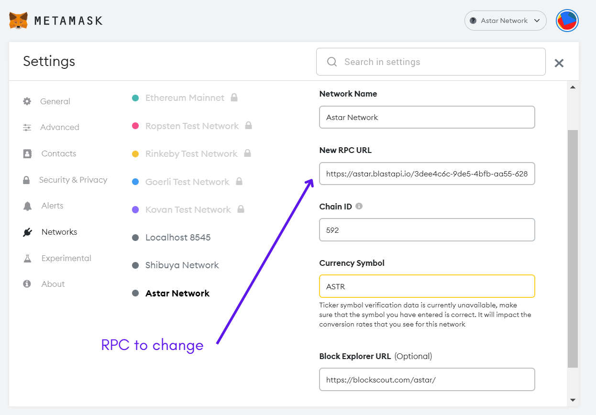
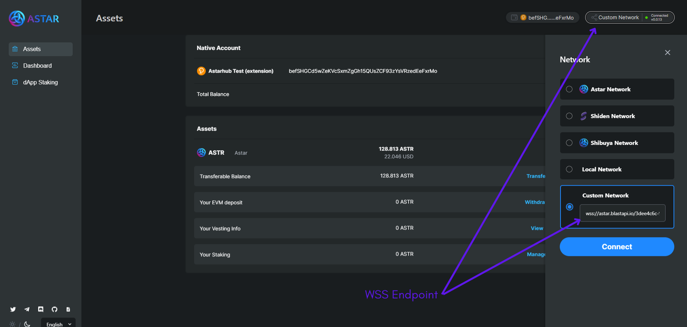
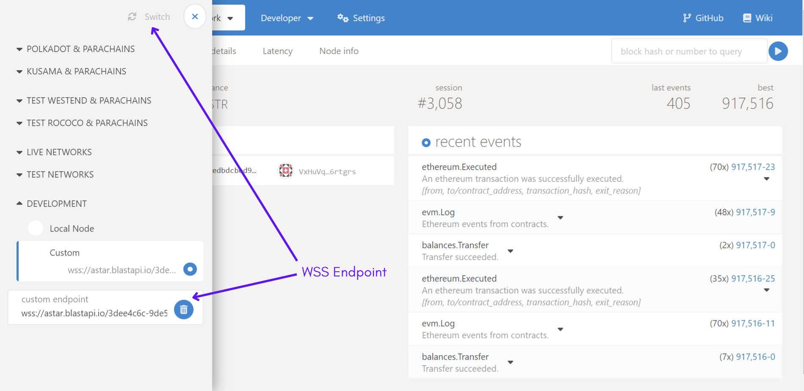

   

   
If you are having trouble connecting to Astar network on the Astar's portal or on Metamask, it is probably because the public nodes are overloaded with demand. The Astar team is constantly working on setting up new nodes and reducing the connection load.

However, you can create and use your own endpoints for free with BwareLabs and not have any connection problems. In this tutorial we show you how to create your endpoints and use them on the Astar's portal, polkadot.js and Metamask.

## Set up your endpoints

— Go to [blastapi.io](http://blastapi.io) and connect your EVM wallet.

— Add a new project, choose a name and select the "Production" environment

— Go to "Available Endpoints" and activate "Astar Mainnet"

— In "Active Endpoints", click on "Astar Mainnet"

— You will then find an RPC Endpoint for EVM and a WSS Endpoint for substrate

   

### RPC & WSS Endpoints 

Congratulations, you have just created your own Endpoints in less than 5 minutes. Now I'll show you how to use them on Metamask and in substrate environments (Astar portal and polkadot.js)

## Metamask

— Copy the RPC Endpoint from [blastapi.io](http://blastapi.io)

— Go to the Astar network settings on Metamask

— Replace your old RPC with the new one

— Save and close the settings

   

## Astar Portal

— Copy the WSS Endpoint from [blastapi.io](http://blastapi.io)

— Go to the [Astar portal](https://portal.astar.network/#/assets)

— In the top right corner, click on "Network", a panel will open

— Under "Custom Network", enter your WSS

— Log in and close the panel

   

## Polkadot.js

— Copy the WSS Endpoint from [blastapi.io](http://blastapi.io)

— Go to the left panel of the [Polkadot.js application](https://polkadot.js.org/apps/#/explorer)

— At the bottom, under "Development", select "Custom" and enter your WSS

— Switch network and close the panel

Once you have configured and modified your endpoints, you will not have any problems connecting to Astar network.
