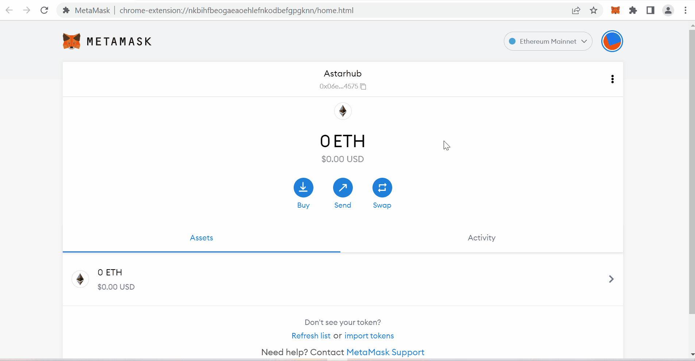

## Wallet setup

To use Astar decentralized applications on EVM chains, we recommend using Metamask, a non-custodial wallet for EVM applications.

To do so, you need to connect your Metamask wallet to Astar Network by adding the following network details : 

## For Astar: 

Network name - Astar Network

EVM RPC - https://astar.api.onfinality.io/public
          https://evm.astar.network

ChainID - 592

Symbol - ASTR

Block explorer - https://blockscout.com/astar/

## For Shiden: 

Network name - Shiden Network

EVM RPC - https://evm.shiden.astar.network

ChainID - 336

Symbol - SDN

Block explorer - https://blockscout.com/shiden/

## For Shibuya: 

Network name - Shibuya Network

EVM RPC -  https://rpc.shibuya.astar.network:8545

ChainID - 81

Symbol - SBY

Block explorer - https://shibuya.subscan.io

## Second option: Setup Metamask using dApp 

Another option is to go to one of the Astar dApps, e.g. Arthswap (https://app.arthswap.org/) and by connecting your Metamask, the dApp will suggest you to add the Astar network. 

Once you have installed MetaMask and set up your wallet, you can use the dApps on Astar or Shiden EVM chains.

