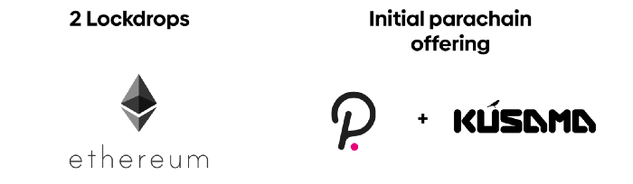

Astar is a multi-chain platform for smart contracts on Polkadot. The protocol aims to realize the multi-chain vision of the future and become a sort of dApps-hub for Layer1 blockchains set (Ethereum, Cosmos, Binance Smart Chain, Solana, etc.). It connects blockchains into one network with the help of bridges.

Astar is perfect for DeFi and NFT applications implementation because it allows performing up to 1000 TPS with minimal fees.

The protocol has distinctive features such as EVM (Ethereum Virtual Machine) and WebAssembly support and Layer2 scalability solutions such as ZK Rollups and Optimistic Rollups.

# Why do we need Astar

Astar is built on the Substrate framework and is a Polkadot parachain. However, Podakot Relay Chain design does not offer facilities for smart contracts development and most other functions. Its main task is to provide the so-called Shared Security for the parachains connected to it.

Therefore, it needs to supplement the development of smart contracts with the help of an appropriate parachain. Astar occupies that niche.

_(Essentially, Podakot is a layer zero (L0) blockchain, while Astar and other parachains are specialized layer one (L1) protocols expanding potentialities of the entire ecosystem. This architecture permits to develop of particularized networks that focus on the qualitative solution of one problem instead of producing a multitude of identical solutions)_

# What Kind of Problems Does It Solve?

Since Astar is a smart-contract platform, we consider this issue from both users&#39; and developers&#39; sid

Users will receive solutions to the scalability and interoperability problems.

**Scalability**

Users will be able to perform more TPS at noticeably lower fees. Faster finality of the transaction also provides. That is the time after which the transaction is considered irreversible with a probability close to 100%. Together with a shorter time between blocks (10–12 seconds), this will allow faster performing various kinds of exchanges between network agents.

_(Most often, users face finality when making deposits to centralized exchanges. For example, most platforms require 12 confirmations (blocks) before crediting tokens to the account for ETH deposits. Therefore, the wait can last for minutes. In the case of BTC, that time is even longer)_

**Interoperability**

Astar will allow moving value from one L1 blockchain to another using bridges, for example, to exchange ETH to BTC. Nowadays, this transferring requires centralized exchanges, which often creates many problems, such as the duration of the process and the need for trust in that exchange.

With the launch of a full-featured network, that problem will solve.

The entire Polkadot ecosystem aims to solve the problems such as scalability and interoperability; Polkadot itself is a solution to these problems. Therefore, it is somewhat more interesting what additional possibilities Astar provide for developers. That is where the protocol features reveal.

**dApp Staking**

One of the challenges for developers of decentralized applications is looking for funding. In contrast to regular companies, these teams do not have a constant cash flow from the services or goods sales, so the development financing problem is quite acute. dApp Staking is a sort of basic income for smart-contract developers. Any application on the platform can receive ASTA tokens depending on usage indices (number of users, etc.) and on-chain voting results.

This system allows you to focus solely on the quality of the final product and not to think about funding sources (at least in the initial stages of application development).

**Support of Several Virtual Machines**

Polkadot (Substrate) natively supports EVM (Ethereum Virtual Machine). That makes it possible to transfer the smart contracts from Ethereum to one of the parachains painlessly, with minimal changes (or even no changes).

Unlike other parachains, Astar offers developers a choice of a handy virtual machine. Besides EVM, WASM (WebAssembly) is also available, which noticeably increases flexibility and development capabilities. At that, inside Astar, EVM-based Smart-contracts can interact seamlessly with WASM-based ones and vice versa.

Astar developers called the technology to support multiple virtual machines X-VM (Cross Virtual Machine).

**Layer-2 Solutions**

Since Polkadot is already a solution for the scalability problem, L2 solutions will most likely not be in full measure demand at the initial stages of the ecosystem development. However, this question will arise in any case at later stages, when the ecosystem has tens of thousands of dApps and millions of users.

Astar is ready for ecosystem growth and offers the second layer scalability solutions such as ZK Rollups and Optimistic Rollups.

**Interaction With Other L1 Blockchains**

Astar will connect the main L1 networks such as Ethereum, Cosmos, Binance Smart Chain, Solana, Avalanche, and others through bridges. That will permit developers to build cross-chain applications and interact with other blockchains almost seamlessly.

# What Is Shiden

Shiden is the Astar canary network, a parachain of the Kusama Network (Kusama, in turn, is the Polkadot canary network).

What does the canary network mean, and why is it needed? It is a testing ground for experimentation, research, and development. Teams can test their solutions in realistic economic conditions first on Shiden, identify and fix bugs, and then transfer a fully working product to Astar.

The network provides the same set of functions as Astar; however, some network parameters have changed. For example, the duration of the tokens unstaking is seven days, instead of 28 on Astar, etc. Accelerating main processes is needed for increasing innovation speed.

It is necessary to understand that this is not a test network. Unlike test networks, canary networks have an economic component that permits testing in &quot;real&quot; conditions.

Also, it shouldn&#39;t forget about the test nature of the network, which theoretically increases the probability of founding bugs.

# Token

ASTA (Astar Native Token) and SDN (Shiden Native Token) have the same use cases and parameters. The initial total token supply is 70,000,000 tokens, and the annual inflation is 10%.

Tokens use for:

— fee payments for transfers within the network;

— payments of rewards to the smart-contracts developers in the dApps staking mechanism;

— payment of rewards for staking (for ordinary users);

— participation in on-chain voting;

— developers need to deposit ASTA / SDN in the corresponding smart contract in the first-layer network to have the ability to launch an application on the second-layer network.

# Initial Tokens Distribution

Astar developers follow the fair launch principle, so you can only get ASTA/SDN before listing on exchanges via lockdrop(1), as well as crowdloan(2) on Polkadot and Kusama. The team does not conduct private sales, ICOs, IEOs, or IDOs.

Both lockdrop took place in 2020. The first batch of auctions on Kusama ended in July 2021 (Shiden was the third winner of the first batch).

Polkadot auctions will beggin on November 11,  2021.

# Rebranding

Initially, the project worked under the name Plasm Network. However, it decided to change the name to Astar because of the almost complete accord with the L2 scalability solution for Ethereum (Plasma) and avoid confusion.
